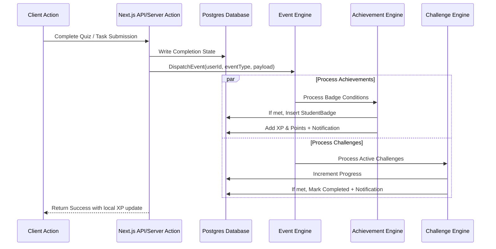

# Sunday School Platform — Phase 2 Design Blueprint (Engagement & Community)

This document provides the technical architecture and specifications for implementing **Phase 2 (Engagement & Community)** of the JoyfulPath Sunday School Platform. 

---

## 1. Updated Database Schema

The Prisma database schema must be updated to support the new features. Below are the new models, fields, and enums to add to [schema.prisma](file:///c:/Users/Dell/Desktop/projects/personal%20projects/church%20app/joyfulpath/prisma/schema.prisma).

### New Enums
```prisma
enum PrayerRequestType {
  prayer
  thanksgiving
}

enum RewardItemType {
  digital
  physical
}

enum DigitalRewardType {
  title
  avatar_frame
  profile_theme
}

enum PhysicalRewardType {
  book
  gift
  stationery
}

enum RedemptionStatus {
  pending
  approved
  rejected
}

enum ChallengeType {
  daily
  weekly
  seasonal
}

enum NotificationType {
  lesson
  challenge
  badge
  reward
  announcement
  prayer
}
```

### New & Modified Models
```prisma
// Modified User model updates:
// - Added digitalRewards JSON to store unlocked digital assets (unlocked titles, frames, themes).
// - Added activeTitle, activeAvatarFrame, activeProfileTheme to store active student cosmetics.
model User {
  // ... existing fields ...
  digitalRewards      Json      @default("{\"titles\":[],\"frames\":[],\"themes\":[]}") @map("digital_rewards") @db.JsonB
  activeTitle         String?   @map("active_title") @db.VarChar(100)
  activeAvatarFrame   String?   @map("active_avatar_frame") @db.Text
  activeProfileTheme  String?   @map("active_profile_theme") @db.VarChar(50)

  // New Relations
  prayerRequests      PrayerRequest[]    @relation("StudentPrayerRequests")
  respondedPrayers    PrayerRequest[]    @relation("InstructorRespondedPrayers")
  redemptions         RewardRedemption[] @relation("StudentRedemptions")
  approvedRedemptions RewardRedemption[] @relation("AdminApprovedRedemptions")
  challengeProgress   ChallengeProgress[]
  notifications       Notification[]
}

// 1. Prayer & Thanksgiving Requests
model PrayerRequest {
  id           String            @id @default(dbgenerated("gen_random_uuid()")) @db.Uuid
  userId       String            @map("user_id") @db.Uuid
  classId      String?           @map("class_id") @db.Uuid
  type         PrayerRequestType @default(prayer)
  content      String            @db.Text
  isPrivate    Boolean           @default(false) @map("is_private")
  isPrayedFor  Boolean           @default(false) @map("is_prayed_for")
  prayedCount  Int               @default(0) @map("prayed_count")
  response     String?           @db.Text
  responderId  String?           @map("responder_id") @db.Uuid
  respondedAt  DateTime?         @map("responded_at") @db.Timestamptz()
  createdAt    DateTime          @default(now()) @map("created_at") @db.Timestamptz()
  updatedAt    DateTime          @default(now()) @updatedAt @map("updated_at") @db.Timestamptz()

  // Relations
  student   User   @relation("StudentPrayerRequests", fields: [userId], references: [id], onDelete: Cascade)
  class     Class? @relation(fields: [classId], references: [id], onDelete: Cascade)
  responder User?  @relation("InstructorRespondedPrayers", fields: [responderId], references: [id], onDelete: SetNull)

  @@index([userId])
  @@index([classId])
  @@index([isPrivate])
  @@map("prayer_requests")
}

// 2. Reward Catalog Items
model RewardItem {
  id             String              @id @default(dbgenerated("gen_random_uuid()")) @db.Uuid
  title          String              @db.VarChar(200)
  titleAr        String?             @map("title_ar") @db.VarChar(200)
  description    String              @db.Text
  descriptionAr  String?             @map("description_ar") @db.Text
  type           RewardItemType
  digitalType    DigitalRewardType?  @map("digital_type")
  physicalType   PhysicalRewardType? @map("physical_type")
  pointsCost     Int                 @map("points_cost")
  imageUrl       String?             @map("image_url") @db.Text
  stock          Int                 @default(0) // 0 means out of stock (or N/A for digital)
  isActive       Boolean             @default(true) @map("is_active")
  metadata       Json                @default("{}") @db.JsonB // e.g. hex codes for themes, custom CSS values
  createdAt      DateTime            @default(now()) @map("created_at") @db.Timestamptz()
  updatedAt      DateTime            @default(now()) @updatedAt @map("updated_at") @db.Timestamptz()

  // Relations
  redemptions RewardRedemption[]

  @@map("reward_items")
}

// 3. Reward Redemptions (Ledger & Workflow Approval)
model RewardRedemption {
  id         String           @id @default(dbgenerated("gen_random_uuid()")) @db.Uuid
  userId     String           @map("user_id") @db.Uuid
  itemId     String           @map("item_id") @db.Uuid
  status     RedemptionStatus @default(pending)
  notes      String?          @db.Text
  feedback   String?          @db.Text
  approvedBy String?          @map("approved_by") @db.Uuid
  approvedAt DateTime?        @map("approved_at") @db.Timestamptz()
  createdAt  DateTime         @default(now()) @map("created_at") @db.Timestamptz()
  updatedAt  DateTime         @default(now()) @updatedAt @map("updated_at") @db.Timestamptz()

  // Relations
  student  User       @relation("StudentRedemptions", fields: [userId], references: [id], onDelete: Cascade)
  item     RewardItem @relation(fields: [itemId], references: [id], onDelete: Cascade)
  approver User?      @relation("AdminApprovedRedemptions", fields: [approvedBy], references: [id], onDelete: SetNull)

  @@index([userId])
  @@index([status])
  @@map("reward_redemptions")
}

// 4. Challenges (Daily/Weekly/Seasonal Goals)
model Challenge {
  id             String        @id @default(dbgenerated("gen_random_uuid()")) @db.Uuid
  title          String        @db.VarChar(200)
  titleAr        String?       @map("title_ar") @db.VarChar(200)
  description    String        @db.Text
  descriptionAr  String?       @map("description_ar") @db.Text
  type           ChallengeType @default(daily)
  criteriaConfig Json          @map("criteria_config") @db.JsonB // Target criteria (e.g. { "type": "lessons", "count": 2 })
  xpReward       Int           @default(50) @map("xp_reward")
  pointsReward   Int           @default(10) @map("points_reward")
  startDate      DateTime      @map("start_date") @db.Timestamptz()
  endDate        DateTime      @map("end_date") @db.Timestamptz()
  isActive       Boolean       @default(true) @map("is_active")
  createdAt      DateTime      @default(now()) @map("created_at") @db.Timestamptz()

  // Relations
  progress ChallengeProgress[]

  @@map("challenges")
}

// 5. Challenge Progress Tracking
model ChallengeProgress {
  id          String    @id @default(dbgenerated("gen_random_uuid()")) @db.Uuid
  userId      String    @map("user_id") @db.Uuid
  challengeId String    @map("challenge_id") @db.Uuid
  currentVal  Int       @default(0) @map("current_val")
  isCompleted Boolean   @default(false) @map("is_completed")
  completedAt DateTime? @map("completed_at") @db.Timestamptz()
  updatedAt   DateTime  @default(now()) @updatedAt @map("updated_at") @db.Timestamptz()

  // Relations
  user      User      @relation(fields: [userId], references: [id], onDelete: Cascade)
  challenge Challenge @relation(fields: [challengeId], references: [id], onDelete: Cascade)

  @@unique([userId, challengeId])
  @@map("challenge_progress")
}

// 6. Notifications Database Store
model Notification {
  id         String           @id @default(dbgenerated("gen_random_uuid()")) @db.Uuid
  userId     String           @map("user_id") @db.Uuid
  type       NotificationType
  titleEn    String           @map("title_en") @db.VarChar(200)
  titleAr    String           @map("title_ar") @db.VarChar(200)
  messageEn  String           @map("message_en") @db.Text
  messageAr  String           @map("message_ar") @db.Text
  isRead     Boolean          @default(false) @map("is_read")
  readAt     DateTime?        @map("read_at") @db.Timestamptz()
  metadata   Json             @default("{}") @db.JsonB // payload routing: e.g. { "badgeId": "...", "challengeId": "..." }
  createdAt  DateTime         @default(now()) @map("created_at") @db.Timestamptz()

  // Relations
  user User @relation(fields: [userId], references: [id], onDelete: Cascade)

  @@index([userId, isRead])
  @@map("notifications")
}
```

---

## 2. API Endpoints Design

For full Next.js App Router API standards, we will implement standard JSON endpoints (`/api/v1/...`).

### A. Prayer Requests API
* **POST `/api/prayer`**: Submit a new prayer or thanksgiving request.
  - *Request Body*: `{ type: "prayer"|"thanksgiving", content: string, isPrivate: boolean }`
* **GET `/api/prayer`**: Retrieve requests.
  - Students see their own requests.
  - Instructors see all class requests (except private requests of other classes if multi-church/class scoping is active).
* **PUT `/api/prayer/[id]`**: Respond or mark as prayed.
  - Instructors mark `isPrayedFor: true` or update `response` field.

### B. Reward Store API
* **GET `/api/rewards`**: Retrieve catalog of active digital and physical reward items.
* **POST `/api/rewards/redeem`**: Initiate redemption.
  - *Request Body*: `{ itemId: string, notes?: string }`
  - *Validation*: Check if student's `totalPoints` >= item's `pointsCost` and item is in stock (if physical).
* **PUT `/api/admin/redemptions/[id]`** (Admin only): Approve or reject a redemption.
  - *Request Body*: `{ status: "approved"|"rejected", feedback?: string }`

### C. Challenges API
* **GET `/api/challenges`**: List currently active challenges matching current date (Daily, Weekly, Seasonal) and user progress.

### D. Notifications API
* **GET `/api/notifications`**: List user's notifications.
* **POST `/api/notifications/read-all`**: Mark all notifications as read.

---

## 3. Event Architecture

To separate logic and support asynchronous badge/challenge checks, we implement a decoupled **Event Engine**.



### Event Engine Interface (`src/lib/events/engine.ts`)
```typescript
export type EventType = 
  | 'LESSON_COMPLETED' 
  | 'QUIZ_COMPLETED' 
  | 'TASK_APPROVED' 
  | 'ATTENDANCE_RECORDED' 
  | 'DAILY_LOGIN';

export interface AppEvent {
  userId: string;
  type: EventType;
  classId?: string;
  timestamp: Date;
  metadata: Record<string, any>;
}

export async function dispatchEvent(event: AppEvent): Promise<void> {
  // 1. Log Activity Log to DB
  await prisma.activityLog.create({
    data: {
      userId: event.userId,
      action: event.type,
      entityType: event.metadata.entityType || 'system',
      entityId: event.metadata.entityId,
      xpChange: event.metadata.xpGranted || 0,
      pointsChange: event.metadata.pointsGranted || 0,
    }
  });

  // 2. Trigger async background checks (using Next.js waitUntil or executing sequentially)
  await Promise.allSettled([
    checkAchievements(event),
    checkChallenges(event)
  ]);
}
```

---

## 4. Notification System Design

Notifications must support instant user feedback while being stored in the database.

### Dynamic Triggers & Templates
1. **Lesson Notification**: Triggered when a new lesson is published.
   - *Message (EN)*: "New lesson added: {title}"
   - *Message (AR)*: "تم إضافة درس جديد: {title}"
2. **Challenge Notification**: Triggered when a challenge is completed.
   - *Message (EN)*: "Challenge Completed! You earned {xp} XP."
   - *Message (AR)*: "اكتمل التحدي! لقد ربحت {xp} نقطة خبرة."
3. **Badge Unlock Notification**: Triggered when a badge is unlocked.
   - *Message (EN)*: "New Badge Unlocked: {badgeName}!"
   - *Message (AR)*: "تم فتح وسام جديد: {badgeName}!"
4. **Reward Notification**: Triggered when an admin approves or rejects a reward redemption.
   - *Message (EN)*: "Your redemption request for {rewardTitle} was approved!"
   - *Message (AR)*: "تمت الموافقة على طلب استبدال مكافأة لـ {rewardTitle}!"

### Notification Delivery Flow
- **REST Polling / SSE fallback**: To bypass WebSockets hosting costs in initial stages, we set up a React context query wrapper that polls `/api/notifications/unread-count` every 45 seconds or establishes a Server-Sent Events (SSE) route `/api/notifications/stream` returning real-time payload when a notification is inserted.

---

## 5. Reward Workflow & State Machine

Redemptions require strict database transaction management to avoid double-spend exploits.

```mermaid
stateDiagram-Model
    [*] --> Pending : User clicks Redeem
    Pending --> Approved : Admin Approves (Sufficient Stock / Points Deducted)
    Pending --> Rejected : Admin Rejects (Feedback Added, Points Re-credited)
    Approved --> [*]
    Rejected --> [*]
```

### Transaction Safe Logic (`src/lib/rewards/service.ts`)
```typescript
export async function redeemReward(userId: string, itemId: string) {
  return await prisma.$transaction(async (tx) => {
    // 1. Get User Points
    const user = await tx.user.findUniqueOrThrow({ where: { id: userId } });
    
    // 2. Get Item Cost and Stock
    const item = await tx.rewardItem.findUniqueOrThrow({ where: { id: itemId } });
    if (!item.isActive) throw new Error('Reward item not active.');
    if (user.totalPoints < item.pointsCost) throw new Error('Insufficient points balance.');
    
    if (item.type === 'physical') {
      if (item.stock <= 0) throw new Error('Item out of stock.');
      // Decrement stock immediately
      await tx.rewardItem.update({
        where: { id: itemId },
        data: { stock: { decrement: 1 } }
      });
    }

    // 3. Deduct points from user balance
    await tx.user.update({
      where: { id: userId },
      data: { totalPoints: { decrement: item.pointsCost } }
    });

    // 4. Create Point Transaction Log
    await tx.pointsTransaction.create({
      data: {
        userId,
        amount: -item.pointsCost,
        type: 'points',
        source: 'redemption',
        sourceId: itemId,
        description: `Redeemed ${item.title}`
      }
    });

    // 5. Create Redemption Request
    const redemption = await tx.rewardRedemption.create({
      data: {
        userId,
        itemId,
        status: 'pending',
      }
    });

    return redemption;
  });
}
```

---

## 6. UI Screens & Flows

All screens support **Light/Dark mode**, **RTL layouts**, and **Full Arabic translations**.

### A. Prayer Requests Screen
* **Student View**:
  - Dual tabs: "All Prayers" (Public) & "My Requests" (Public/Private list).
  - Submit Form: Text area with toggle for "Submit anonymously/Private to Instructors".
  - Core Interactivity: A heart icon ("Amen" / "Mark as Prayed For") which triggers points bonus and increases `prayedCount`.
* **Instructor View**:
  - Filterable inbox categorized by: "Pending Response", "Prayed For", "Private Requests".
  - Fast response modal: input box for typing encouragement.

### B. Reward Store Screen
* **Store Front Grid**: Categorized filters for Digital Items (Themes, Custom Badges, Titles) and Physical Items.
* **Redemption Confirmation Modal**: Displays current user points balance, points cost, and remaining points after redemption.
* **Admin Redemption Queue**:
  - Table showing Student Name, Item, Cost, Date, Actions (Approve, Reject with Feedback input).

### C. Achievements & Challenges Dashboard
* **Dynamic XP Progress Card**: Sleek circular progress container showing current Level, current XP, and XP required for next level.
* **Active Challenges Checklist**:
  - Daily Challenge card (e.g. "Answer 1 review quiz today") showing a checklist or slider bar (e.g. 0/1).
  - Weekly Challenge card (e.g. "Attend class & complete 3 lessons").

---

## 7. Folder Structure Updates

Ensure Phase 2 files map neatly to the existing Next.js App directory structure:

```
src/
├── app/
│   ├── (dashboard)/
│   │   ├── student/
│   │   │   ├── prayers/             # NEW: Student Prayer Submission Screen
│   │   │   ├── store/               # NEW: Student Reward Catalog Shop
│   │   │   └── challenges/          # NEW: Challenges Checklist
│   │   ├── admin/
│   │   │   └── redemptions/         # NEW: Admin Approval queue
│   │   └── instructor/
│   │       └── prayers/             # NEW: Instructor review and response page
│   └── api/
│       ├── prayer/                  # NEW: APIs for Prayer Requests
│       └── rewards/                 # NEW: APIs for Redemptions
├── lib/
│   ├── events/
│   │   ├── engine.ts                # NEW: Dispatcher and activity logging
│   │   ├── achievements.ts          # NEW: Badge unlocking checks
│   │   └── challenges.ts            # NEW: Challenge progress calculator
│   └── rewards/
│       └── service.ts               # NEW: Points transactions and balance validation
```

---

## 8. Testing Strategy

1. **Unit Testing Level Calculation**:
   - Verify level boundaries:
     $$\text{Level}(XP) = \text{calculated tier mathematically or database lookup}$$
   - Write tests validating user moves from level 1 to level 2 at exactly 100 XP.
2. **Transaction Integrity Tests**:
   - Write concurrent request simulation tests to verify that a student cannot execute double redemptions if they click the button multiple times simultaneously.
3. **Event Queue Trigger Tests**:
   - Mock Prisma db, fire `QUIZ_COMPLETED` with score of 100%, assert `StudentBadge` is generated if it reaches the criteria count.
