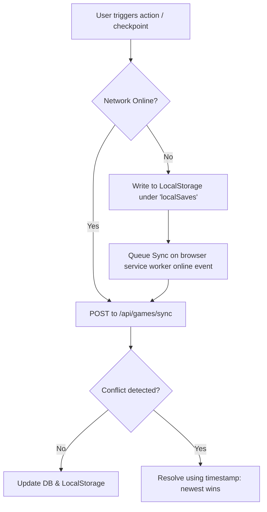

# Sunday School Platform — Phase 3 Design Blueprint (Interactive Learning & Games)

This document details the architectural design and system specifications to transform the Sunday School Platform into a highly gamified, interactive learning system (**Phase 3**).

---

## 1. Game Engine Architecture

The game components operate as a modular set of frontend clients that interact with a core `GameEngineService` on the Next.js server. The frontend utilizes React state or lightweight state machines for rendering gameplay loops, while the backend processes completion triggers and rewards.

```
┌────────────────────────────────────────────────────────────────────────┐
│                              FRONTEND CLIENT                           │
├───────────────┬─────────────────┬────────────────┬─────────────────────┤
│  Quiz Module  │  Verse Builder  │  Memory Match  │   Bible Adventure   │
│ (Timed Loop)  │ (Drag-and-Drop) │  (Grid Flip)   │ (Canvas/Map Render) │
└───────┬───────┴────────┬────────┴────────┬───────┴──────────┬──────────┘
        │                │                 │                  │
        └────────────────┼─────────────────┼──────────────────┘
                         ▼
        ┌────────────────────────────────────────────────────────┐
        │                 GameEngine Controller                  │
        │             (State Manager & Input Filter)             │
        └────────────────────────┬───────────────────────────────┘
                                 │
                                 ▼
┌────────────────────────────────────────────────────────────────────────┐
│                             BACKEND SERVICES                           │
├────────────────────────┬───────────────────────────────────────────────┤
│    GameSaveManager     │            Security & Anti-Cheat              │
│  (Database sync API)   │         (Validates times & actions)           │
└────────────────────────┴───────────────────────────────────────────────┘
```

### Common Game Interface (`src/types/games.ts`)
```typescript
export interface GameSession {
  sessionId: string;
  gameType: 'quiz' | 'verse_builder' | 'memory_match' | 'treasure_hunt' | 'adventure';
  userId: string;
  startedAt: string;
  gameState: Record<string, any>;
}

export interface GameScoreResult {
  sessionId: string;
  score: number;
  timeSpentSeconds: number;
  isComplete: boolean;
  cheatVerified: boolean;
  rewards: {
    xpEarned: number;
    pointsEarned: number;
    badgesUnlocked: string[];
  };
}
```

---

## 2. Database Additions

We will append the following schema elements to [schema.prisma](file:///c:/Users/Dell/Desktop/projects/personal%20projects/church%20app/joyfulpath/prisma/schema.prisma) to trace reading streaks, game scores, and verse memorization progress.

```prisma
// 1. Reading Plans & Streaks
model ReadingPlan {
  id             String         @id @default(dbgenerated("gen_random_uuid()")) @db.Uuid
  title          String         @db.VarChar(200)
  titleAr        String?        @map("title_ar") @db.VarChar(200)
  description    String?        @db.Text
  descriptionAr  String?        @map("description_ar") @db.Text
  chaptersList   Json           @map("chapters_list") @db.JsonB // e.g. [{ "book": "Genesis", "chapter": 1 }, ...]
  xpReward       Int            @default(20) @map("xp_reward")
  createdAt      DateTime       @default(now()) @map("created_at") @db.Timestamptz()

  // Relations
  studentProgress StudentReadingProgress[]

  @@map("reading_plans")
}

model StudentReadingProgress {
  id            String      @id @default(dbgenerated("gen_random_uuid()")) @db.Uuid
  userId        String      @map("user_id") @db.Uuid
  planId        String      @map("plan_id") @db.Uuid
  completedList Json        @default("[]") @map("completed_list") @db.JsonB // e.g. [{"book": "Genesis", "chapter": 1, "completedAt": "..."}]
  currentStreak Int         @default(0) @map("current_streak")
  lastReadAt    DateTime?   @map("last_read_at") @db.Timestamptz()
  updatedAt     DateTime    @default(now()) @updatedAt @map("updated_at") @db.Timestamptz()

  // Relations
  user User        @relation(fields: [userId], references: [id], onDelete: Cascade)
  plan ReadingPlan @relation(fields: [planId], references: [id], onDelete: Cascade)

  @@unique([userId, planId])
  @@map("student_reading_progress")
}

// 2. Verse Memorization Tracking
model MemorizedVerse {
  id             String   @id @default(dbgenerated("gen_random_uuid()")) @db.Uuid
  userId         String   @map("user_id") @db.Uuid
  verseReference String   @map("verse_reference") @db.VarChar(100) // e.g. "Psalm 23:1"
  verseText      String   @map("verse_text") @db.Text
  verseTextAr    String?  @map("verse_text_ar") @db.Text
  progressPct    Int      @default(0) @map("progress_pct") // 0 to 100% memorization confidence
  isMastered     Boolean  @default(false) @map("is_mastered")
  lastTestedAt   DateTime? @map("last_tested_at") @db.Timestamptz()
  createdAt      DateTime @default(now()) @map("created_at") @db.Timestamptz()

  // Relations
  user User @relation(fields: [userId], references: [id], onDelete: Cascade)

  @@unique([userId, verseReference])
  @@map("memorized_verses")
}

// 3. Game Progress & Save Files
model GameState {
  id           String   @id @default(dbgenerated("gen_random_uuid()")) @db.Uuid
  userId       String   @map("user_id") @db.Uuid
  gameType     String   @map("game_type") @db.VarChar(50) // e.g. "bible_adventure"
  activeData   Json     @map("active_data") @db.JsonB // Save state payload
  checkpointId String?  @map("checkpoint_id") @db.VarChar(100)
  updatedAt    DateTime @default(now()) @updatedAt @map("updated_at") @db.Timestamptz()

  // Relations
  user User @relation(fields: [userId], references: [id], onDelete: Cascade)

  @@unique([userId, gameType])
  @@map("game_states")
}

// 4. Learning Analytics & Stats
model GameStatistics {
  id               String   @id @default(dbgenerated("gen_random_uuid()")) @db.Uuid
  userId           String   @map("user_id") @db.Uuid
  gameType         String   @map("game_type") @db.VarChar(50)
  attemptsCount    Int      @default(0) @map("attempts_count")
  highScore        Int      @default(0) @map("high_score")
  totalTimeSeconds Int      @default(0) @map("total_time_seconds")
  lastPlayedAt     DateTime @default(now()) @map("last_played_at") @db.Timestamptz()

  // Relations
  user User @relation(fields: [userId], references: [id], onDelete: Cascade)

  @@unique([userId, gameType])
  @@map("game_statistics")
}
```

---

## 3. State Management Strategy

To ensure fluid gameplay and offline capability, client state management utilizes **Zustand** stores.

### Game State Store Definition (`src/stores/useGameStore.ts`)
```typescript
import { create } from 'zustand';
import { persist } from 'zustand/middleware';

interface GameProgressState {
  // Offline cached saves
  localSaves: Record<string, { data: any; lastSaved: string }>;
  activeQuiz: {
    questions: any[];
    currentIndex: number;
    answers: Record<string, string>;
    timeRemaining: number;
  } | null;
  
  // Actions
  saveLocalGame: (gameType: string, data: any) => void;
  syncLocalWithServer: (userId: string) => Promise<void>;
  startQuiz: (questions: any[], limit: number) => void;
  answerQuestion: (questionId: string, answer: string) => void;
  tickQuizTimer: () => void;
}

export const useGameStore = create<GameProgressState>()(
  persist(
    (set, get) => ({
      localSaves: {},
      activeQuiz: null,
      
      saveLocalGame: (gameType, data) => {
        set((state) => ({
          localSaves: {
            ...state.localSaves,
            [gameType]: { data, lastSaved: new Date().toISOString() },
          },
        }));
      },
      
      syncLocalWithServer: async (userId) => {
        const { localSaves } = get();
        // Submit local saves to /api/games/sync and resolve conflicts
      },

      startQuiz: (questions, limit) => {
        set({ activeQuiz: { questions, currentIndex: 0, answers: {}, timeRemaining: limit } });
      },

      answerQuestion: (questionId, answer) => {
        set((state) => {
          if (!state.activeQuiz) return state;
          return {
            activeQuiz: {
              ...state.activeQuiz,
              answers: { ...state.activeQuiz.answers, [questionId]: answer },
            },
          };
        });
      },

      tickQuizTimer: () => {
        set((state) => {
          if (!state.activeQuiz || state.activeQuiz.timeRemaining <= 0) return state;
          return {
            activeQuiz: {
              ...state.activeQuiz,
              timeRemaining: state.activeQuiz.timeRemaining - 1,
            },
          };
        });
      },
    }),
    { name: 'joyfulpath-game-storage' }
  )
);
```

---

## 4. Game Save & Synchronization System

Since students might experience unstable internet connection during class, game progress operates on an **Offline-First Synchronization Engine**.



### Sync Sync API Endpoint (`/api/games/sync`)
- Evaluates checksums of the state objects.
- Uses `lastSaved` ISO timestamps to determine if incoming client data is newer than database state.
- Returns the resolved state back to the client to update local storage storage.

---

## 5. UI Screen Layout Specifications

All game boards are tailored to children with clear visuals, micro-animations via `framer-motion`, and fully Arabic-compatible typography using the *Cairo* font.

### A. Bible Quiz (Timed Review)
* **Design**: Minimal distraction. A prominent countdown timer circles dynamically at the top center. Card contains the question with colorful button layouts for options.
* **Micro-Animations**: Hover zoom on options; red/green color transition on answer lock.

### B. Verse Builder
* **Design**: Split panel structure.
  - Top: target slots (empty dashed outlines).
  - Bottom: scrambled word bubbles that students can click or drag.
* **Arabic Optimization**: Word layouts correctly sorted from right to left (RTL) when Arabic is active.

### C. Memory Match
* **Design**: Grid of face-down cards (e.g. 4x4 or 6x6). Each card features a gold JoyfulPath emblem.
* **Gameplay**: Flip matching pairs of Biblical characters (e.g., Abraham & Isaac, David & Goliath) or symbols.
* **Micro-Animations**: Smooth 3D rotational flip on click.

### D. Bible Adventure Map (Story Mode)
* **Design**: Side-scroller path representing landmarks. Active nodes are brightly colored and unlocked; future nodes are greyed out with padlocks.
* **Visuals**: Illustrated styles depicting stories (e.g., Noah’s Ark floating, Moses parting the Red Sea).

---

## 6. API Contracts Design

Standard endpoints for Phase 3 games:

### A. GET `/api/games/quiz/start`
- *Query Params*: `{ lessonId?: string, difficulty: "easy"|"medium"|"hard" }`
- *Returns*: `{ quizId: string, questions: Array<{ id: string, text: string, options: string[] }>, timeLimit: number }`

### B. POST `/api/games/quiz/submit`
- *Request Body*: `{ quizId: string, answers: Record<string, string>, elapsedSeconds: number }`
- *Server-Side Processing*:
  - Computes score.
  - Checks if elapsedSeconds is physically possible (prevents injection of 0-second completions).
  - Dispatches event to Achievement Engine.
- *Returns*: `GameScoreResult`

### C. POST `/api/games/sync`
- *Request Body*: `{ localSaves: Array<{ gameType: string, data: any, updatedAt: string }> }`
- *Returns*: `{ status: "success", synchronized: string[], serverState: Record<string, any> }`

---

## 7. Analytics Dashboard Design

To help instructors monitor students, we design a comprehensive statistics collector.

### Metrics Computed
- **Quiz Mastery Index**: Average score across last 10 quizzes.
- **Reading Velocity**: Average chapters read per week.
- **Memorization Mastery**: Count of verses fully memorized.
- **Risk Indicator**: Alert triggers when a student's streak drops to 0 or login inactivity passes 14 days.

---

## 8. Quality Assurance & Testing Plan

1. **Cheat Prevention Assertions**:
   - Write backend tests that reject quiz submissions with `elapsedSeconds` lower than 2 seconds per question.
   - Reject submissions where matching card flip event timestamps show instant pairings (indicates automated DOM automation).
2. **Local Storage Fallback Tests**:
   - Disable networking in headless test environment, trigger saving game state, assert state resides in IndexedDB/LocalStorage, enable connection, trigger manual sync, verify DB integrity.
3. **Arabic RTL Word Order Validation**:
   - Write unit tests validating that the scrambled words list inside Verse Builder correctly maps from indexes 0..N dynamically mirroring the RTL CSS direction configurations.
