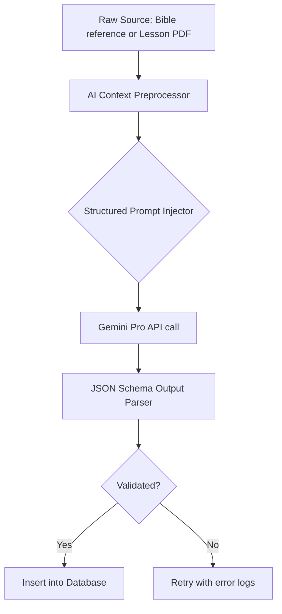

# Sunday School Platform — Phase 4 Design Blueprint (Ecosystem & Intelligence)

This document provides the production-level system design, AI architectures, multi-tenant database designs, mobile specifications, and operational cost projections to deliver **Phase 4 (Ecosystem & Intelligence)** of the JoyfulPath Sunday School Platform.

---

## 1. Updated System Architecture

To support mobile apps, AI services, and multi-tenant churches, the platform evolves into a unified architecture.

```
                  ┌──────────────────────┐
                  │     Mobile App       │
                  │ (React Native/Expo)  │
                  └──────────┬───────────┘
                             │ (https/graphql)
                             ▼
┌──────────────┐  ┌──────────────────────┐  ┌──────────────┐
│  Web Client  ├─►│     Next.js API      │◄─┤ Parent Portal│
│ (Next-Intl)  │  │   Gateway Routing    │  │ (Dashboard)  │
└──────────────┘  └──────────┬───────────┘  └──────────────┘
                             ├──────────────────────┐
                             ▼                      ▼
                  ┌──────────────────────┐  ┌──────────────┐
                  │    Prisma Engine     │  │  AI Service  │
                  │ (Tenant Context Row) │  │ (Gemini API) │
                  └──────────┬───────────┘  └──────────────┘
                             ▼
                  ┌──────────────────────┐
                  │   PostgreSQL DB      │
                  │ (RLS Partitioned)    │
                  └──────────────────────┘
```

---

## 2. AI Service Design

All intelligence features integrate with the **Gemini API** (using the official `@google/generative-ai` SDK) to leverage advanced reasoning, fast inference, and structured outputs.

### AI Engine System Design



### Prompt Engineering and SDK Implementation Example (`src/lib/ai/service.ts`)
```typescript
import { GoogleGenAI } from '@google/generative-ai';

const ai = new GoogleGenAI({ apiKey: process.env.GEMINI_API_KEY });

export async function generateQuizFromContent(textSource: string, questionCount: number = 5) {
  const model = ai.getGenerativeModel({ model: 'gemini-1.5-flash' });
  
  const prompt = `
    You are an expert Sunday School curriculum builder. Generate exactly ${questionCount} multiple choice questions (MCQs) based on the text below.
    Format your response as a strict JSON array matching this typescript definition:
    Array<{
      questionText: string;
      options: string[];
      correctAnswer: string; // must match one of options exactly
      explanation: string;
    }>
    
    Source Text:
    "${textSource}"
  `;

  const response = await model.generateContent(prompt);
  const responseText = response.response.text();
  
  // Parse and validate JSON structure
  const quizData = JSON.parse(responseText.trim());
  return quizData;
}
```

---

## 3. Mobile Architecture (iOS & Android)

The mobile experience is built using **React Native + Expo** to guarantee cross-platform consistency and code sharing.

### Core Stack
* **State & Sync**: `WatermelonDB` or SQLite wrapper providing localized reactive offline databases.
* **Push Notifications**: Expo Notifications service (`expo-notifications`) linked to Firebase Cloud Messaging (FCM) and Apple Push Notification Service (APNs).
* **Storage**: Camera uploads (e.g. photo of homework) are compressed locally using `expo-image-manipulator` and uploaded directly to secure Supabase/AWS S3 signed URLs.

### Offline Sync Protocol
- **WatermelonDB Sync Engine**: Pull updates from `/api/mobile/sync` using local timestamps; push client changes containing locally generated UUIDs to resolve conflicts using *server-wins* rule.

---

## 4. Multi-Tenant Database Design

To allow independent administration of multiple churches sharing a single deployment, database records are partitioned by a `tenantId` representing a Church.

### Tenant Context Filter (`prisma/schema.prisma` updates)
```prisma
model ChurchTenant {
  id        String   @id @default(dbgenerated("gen_random_uuid()")) @db.Uuid
  name      String   @db.VarChar(200)
  slug      String   @unique @db.VarChar(100) // E.g., 'st-mark-cairo'
  isActive  Boolean  @default(true) @map("is_active")
  createdAt DateTime @default(now()) @map("created_at") @db.Timestamptz()

  // Relations
  users     User[]
  classes   Class[]
  // ... all other database entities map to this tenant
  @@map("church_tenants")
}
```

### Query Enforcement Strategy
To guarantee data isolation, all Prisma queries check active session tenant contexts:
```typescript
// Prisma Middleware / Extension
export const tenantExtension = (tenantId: string) => {
  return prisma.$extends({
    query: {
      $allModels: {
        async $allOperations({ model, operation, args, query }) {
          if (['findMany', 'findUnique', 'findFirst', 'update', 'delete'].includes(operation)) {
            // Force filter by tenantId
            args.where = { ...args.where, tenantId };
          }
          return query(args);
        },
      },
    },
  });
};
```

---

## 5. Parent Portal Design

Parents manage and monitor their children's progress via a specialized access permission.

### Relations Schema
```prisma
model ParentChildRelation {
  id         String   @id @default(dbgenerated("gen_random_uuid()")) @db.Uuid
  parentId   String   @map("parent_id") @db.Uuid
  childId    String   @map("child_id") @db.Uuid
  relation   String   @default("parent") // e.g. Father, Mother, Guardian
  createdAt  DateTime @default(now()) @map("created_at") @db.Timestamptz()

  // Relations
  parent     User     @relation("ParentRelation", fields: [parentId], references: [id], onDelete: Cascade)
  child      User     @relation("ChildRelation", fields: [childId], references: [id], onDelete: Cascade)

  @@unique([parentId, childId])
  @@map("parent_child_relations")
}
```

### Parent UI Features
* **Progress Report**: Real-time visualization of child's XP bar, unlocked achievements, active streaks, and reading levels.
* **Attendance Ledger**: Visual list of Present/Late/Absent flags mapped to calendar dates.
* **Class Announcements**: Feed containing homework requirements and announcements.

---

## 6. Advanced Analytics & Risk Detection

For instructors, the system provides predictive insight algorithms.

### Student Risk Threshold Formula
A student is flagged as **At-Risk** if their engagement score falls below 30/100:
$$\text{Engagement Score} = (0.4 \times \text{AttendanceRate}) + (0.3 \times \text{TaskCompletionRate}) + (0.3 \times \text{StreakRatio})$$
- **AttendanceRate**: Percentage of Present sessions in last 6 weeks.
- **TaskCompletionRate**: Percentage of submitted tasks.
- **StreakRatio**: Active streak / Longest streak.

---

## 7. Security, Privacy & Compliance (COPPA)

Since the target audience includes children under 13:
1. **COPPA Compliance**: No Personally Identifiable Information (PII) is displayed publicly. Leaderboards display student nickname/displayName instead of full name.
2. **Parental Consent**: Account creations for students under 13 must be linked to a verified parent account.
3. **Data Encryption**: All PII (emails, names, phone numbers) are encrypted in database tables using AES-GCM 256.

---

## 8. Scalability Plan

* **Cache Strategy**: Implement Redis caching layers for:
  - Global leaderboard data (cached for 10 minutes).
  - Session authorization tokens.
* **Database Optimization**: Add indexes for key fields: `tenantId`, `userId`, `classId`, and composite key `(userId, isRead)` on notifications.
* **Static Asset Delivery**: All images, avatars, lesson attachments, and audio files are served via a CDN (e.g. Cloudflare) with long-duration caching headers.

---

## 9. Budget & Cost Analysis

Based on an estimate of 10 churches, 100 instructors, and 1,000 active students:

| Service | Tier / Usage | Estimated Monthly Cost (USD) |
| :--- | :--- | :--- |
| **Hosting (Next.js API & Gateway)** | Vercel Pro Plan / AWS Lambda | $40.00 |
| **Database (PostgreSQL)** | Neon Serverless / Supabase Pro | $25.00 |
| **AI Models (Gemini API)** | 500,000 Input tokens / 200,000 Output tokens | $15.00 |
| **Storage (Images, PDFs, audio)** | 50 GB storage, CDN bandwidth | $10.00 |
| **Push Notifications & Cache** | Firebase / Expo (Free) / Redis | $0.00 - $10.00 |
| **Total Estimated Cost** | — | **$90.00 - $100.00 / month** |

---

## 10. Production Deployment Strategy

* **CI/CD Pipeline**: GitHub Actions testing typescript compilation, linting, and formatting -> deploying automatically to Vercel/AWS staging on PR merge -> production on main release tagging.
* **Database Migrations**: Migrations are run safely using Prisma during deployment phases:
  ```bash
  prisma migrate deploy
  ```
* **Disaster Recovery**: Automatic daily rolling DB snapshots stored in a separate geographical region with a target Recovery Point Objective (RPO) of 24 hours.
